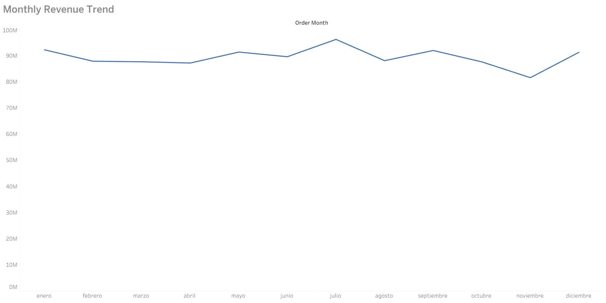
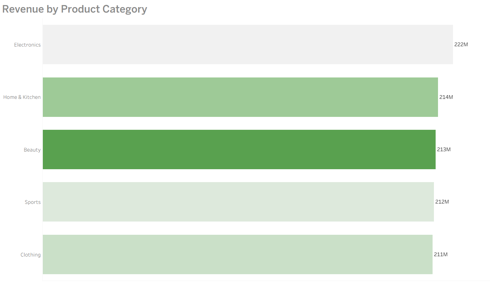
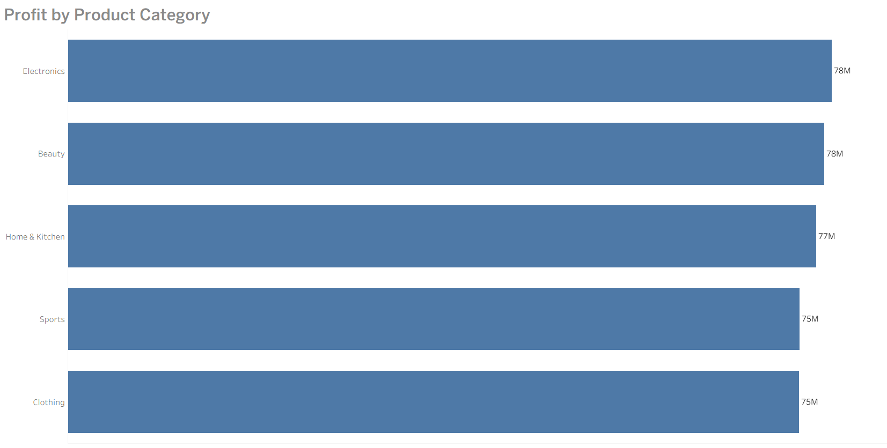
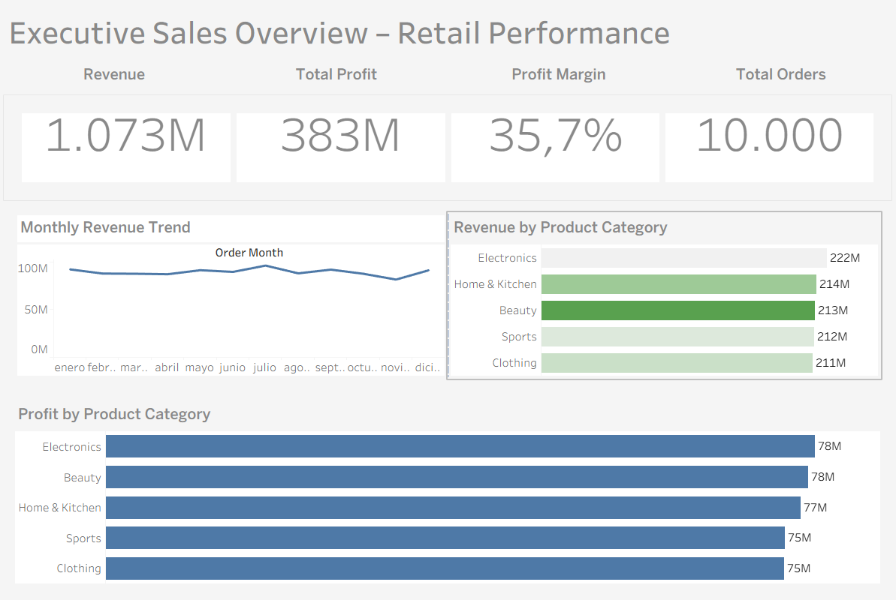

# Retail Performance Dashboard – Tableau  

## Executive Sales Overview – Retail Performance  

This project presents an executive-level retail performance dashboard built in Tableau Public.  
It focuses on revenue, profitability, and operational efficiency across product categories.

The dashboard is designed for decision-makers who require a clear, high-level overview of business performance supported by structured analytical insights.

## Business Context  

Retail businesses require continuous monitoring of financial and operational KPIs to ensure sustainable growth and profitability.

This dashboard enables:

- Revenue performance tracking  
- Profitability evaluation  
- Category-level comparison  
- Monthly trend analysis  
- Executive-level KPI monitoring  

## Business Questions Answered  

- How is total revenue performing?  
- What is the overall profit margin?  
- Which product categories generate the highest revenue?  
- Which categories are the most profitable?  
- Are there visible monthly revenue fluctuations?  

## Key Performance Indicators (KPIs)

- Total Revenue (Millions)  
- Total Profit (Millions)  
- Profit Margin (%)  
- Total Orders  

All KPIs are displayed in an executive KPI row for immediate visibility.

## Dashboard Structure  

### Executive KPI Section  

Top-level summary including:

- Total Revenue  
- Total Profit  
- Profit Margin  
- Total Orders  

### Monthly Revenue Trend  

Line chart displaying revenue evolution across months to identify seasonality and fluctuations.

### Revenue by Product Category  

Horizontal bar chart comparing total revenue across product categories.

### Profit by Product Category  

Horizontal bar chart highlighting category-level profitability performance.

## Full Dashboard Preview  

## Live Interactive Version  

View the full interactive dashboard on Tableau Public:

**[View Interactive Dashboard](https://public.tableau.com/views/Retail_Profitability_Dashboard_v1/ExecutiveSalesOverviewRetailPerformance?:language=en-US&publish=yes&:display_count=n&:origin=viz_share_link)**

## Technical Stack  

- Tableau Public  
- Calculated Fields  
- KPI Card Design  
- Data Cleaning & Numeric Conversion  
- Dashboard Layout Structuring  
- Visual Hierarchy Optimization  

## Technical Notes  

### Calculated Fields  

- **Profit Margin**  
  `SUM(Profit) / SUM(Revenue)`

- Revenue and Profit were cleaned and converted from text format to numeric using calculated fields.

- Units standardized to Millions (M) for executive readability.

### Data Preparation  

- Removed formatting characters from numeric fields.  
- Converted text-based numeric columns to FLOAT.  
- Ensured aggregation consistency across all KPIs.  

### Design Decisions  

- Executive-first layout (KPI row on top).  
- Minimal visual noise (gridlines removed).  
- Consistent category color logic.  
- Structured analytical hierarchy:  
  KPIs → Trend → Category Analysis  

## Key Takeaways  

- Revenue and profit distribution is relatively balanced across categories.  
- Electronics and Beauty lead in revenue contribution.  
- Profit margins remain stable across product segments.  
- Monthly revenue shows moderate fluctuations without extreme volatility.  

## Author  

**Fiorella Mareco**  
Business Informatics Student  
Aspiring Data & Business Analyst  
